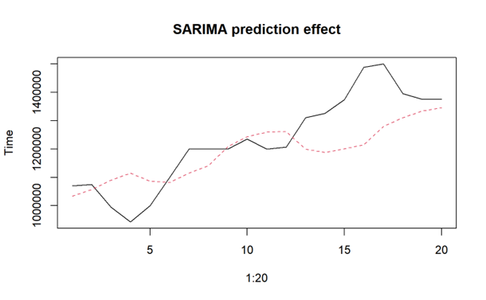
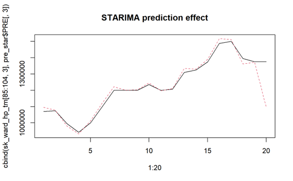

# House Price Prediction Based on ARIMA Model and STARIMA Model

## Introduction

This project builds a forecasting model for the house price in Dulwich Village.

## Methods/Models 

-   SARIMA(Seasonal ARIMA) Model -- temporal model

-   STARIMA Model-- spatio-temporal model

## Result

STARIMA model can better explain the spatio-temporal pattern and make more accurate predictions.

## Reference

R package *STARIMA* developed by the Spatio-temporal Data Mining Group from UCL
